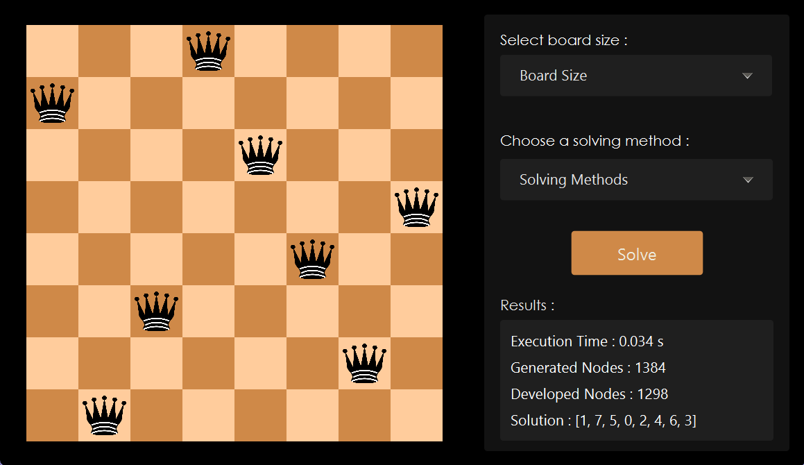

# N-Queens Solver

## Overview
The N-Queens Solver is a Java application that provides solutions to the N-Queens problem using various search algorithms. The project utilizes Java and JavaFX for the user interface, allowing users to interactively visualize the solving process.

## Features
- Solve the N-Queens problem with different board sizes.
- Implementations of BFS, DFS, A* with different heuristics, genetic algorithm, and particle swarm optimization.
- Visualize the solving process with JavaFX.
- Performance comparison of different search algorithms and optimization techniques.
- Easy-to-use interface for experimenting with different algorithms and board configurations.

## Usage
1. Run the NQueensApplication.java file to launch the application.
2. Choose the desired board size and algorithm from the options provided.
3. Click the "Solve" button to initiate the solving process.
4. Visualize the progress and results on the chessboard displayed.

## Dependencies
Java JDK 
JavaFX 
